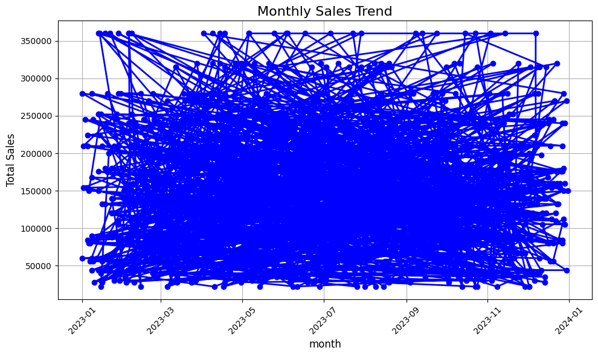
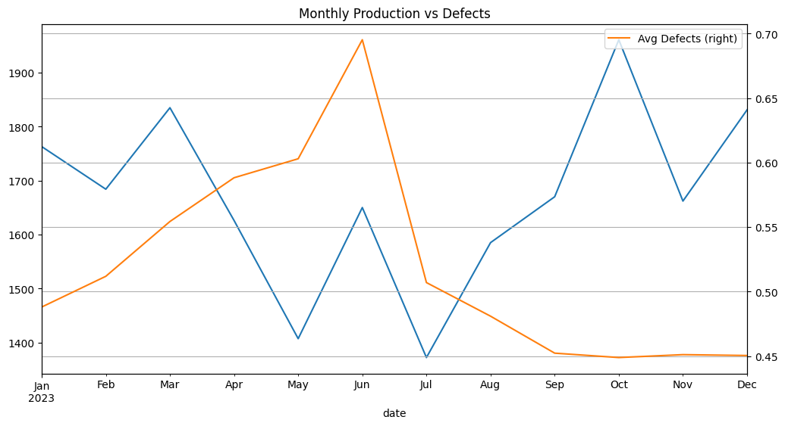
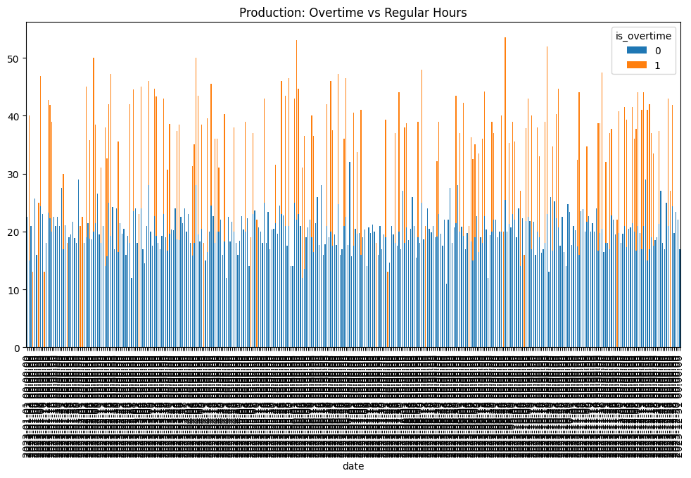
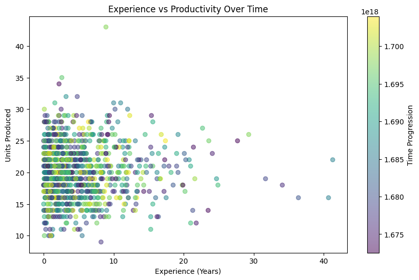

# 📈 Automotive Manufacturing Data Analysis
📌 Project Overview

This project analyzes manufacturing data to uncover insights on:

✅ Production Efficiency (units produced, defect rates)

✅ Workforce Performance (shift comparisons, overtime impact)

✅ Sales Trends (monthly revenue, model-wise sales)

The project showcases how to derive insights using feature engineering, grouping, filtering, and visual analytics. Below is a detailed breakdown of the analysis.

🔧 Feature Engineering

New variables were created from the original dataset to enable deeper insights:

- Total_sales: Calculated as Price × Quantity.

- Month and Day: Extracted from the Date column to support temporal analysis.

🔍 Grouping & Filtering
Data was grouped and filtered to reveal hidden patterns:

- Models and Units Produced: Identify which models dominate production.

- Shifts vs Units Produced: Compare productivity across work shifts (e.g., Morning, Afternoon, Night).

- Group by Month and Model: Monthly performance of individual models.

- Group by Experience Level: Evaluate impact of staff experience on output.

Filters were applied to identify:

- High-performing models (models with sales > 150,000).

- Sales made in specific timeframes (January).
  
📈 Trend Analysis and Visualizations
Several graphs were generated to visualize patterns over time and other variables:

✅ Monthly Production Trends
- A line chart displaying how total sales varied across months.

- Helps identify peak production periods and seasonality.

✅ Monthly Production vs Defects
- A dual-axis chart comparing production volume and defect rates.

- Useful for quality control and improvement strategies.

✅ Daily Production by Shift

A bar chart comparing the number of units produced each day across different shifts.

Supports shift optimization and staffing decisions.

✅ Overtime Impact Analysis
- Scatter plots showing correlation between overtime hours and unit output.

- Used to evaluate whether overtime leads to proportional productivity gains.

✅ Experience vs Productivity Correlation
- A regression plot analyzing the relationship between worker experience and production levels.

- Insightful for training and talent management strategies.

📦 Tools Used
- Python: Data analysis and visualization

- Pandas: Data manipulation

- Matplotlib & Seaborn: Plotting and trend visualization

- Jupyter Notebook: Interactive exploration

  

