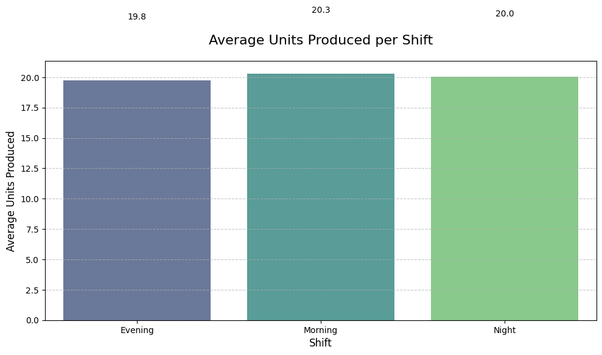
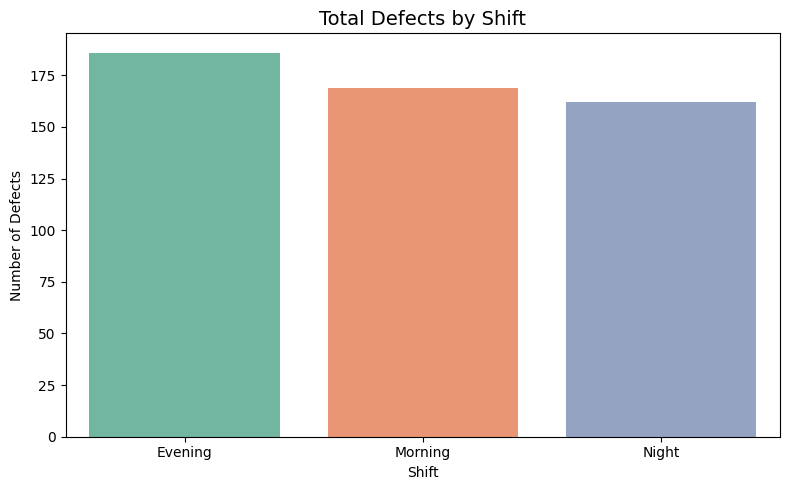

# 📈 Automotive Manufacturing Data Analysis
📌 About the Project

This project focuses on exploring and analyzing automotive manufacturing data to uncover valuable insights such as trends, optimized productivity, and understand quality control patterns. Using data analysis techniques, the study investigates how various factors like production shift, model type, and worker experience affect unit output and defect rates. The project involves extensive feature engineering, including calculating total sales, extracting temporal features (month and day), and visualizing production and sales performance over time.

Key analytical areas include:

- Trend analysis of monthly production and sales.

- Grouping and filtering to understand performance across models and shifts.

- Correlation studies, such as experience vs productivity.

- Visual exploration using plots and charts to reveal patterns in production defects, overtime impact, and unit efficiency.

This project showcases how data can help in data-driven decision-making and continuous process improvement in the automotive industry.

🔧 Feature Engineering

New variables were created from the original dataset to enable deeper insights:

- Total_sales: Calculated as Price × Quantity.

- Month and Day: Extracted from the Date column to support temporal analysis.

🔍 Grouping & Filtering
Data was grouped and filtered to reveal hidden patterns:

- Models and Units Produced: Identify which models dominate production.

- Shifts vs Units Produced: Compare productivity across work shifts (e.g., Morning, Afternoon, Night).

- Group by Month and Model: Monthly performance of individual models.

- Group by Experience Level: Evaluate impact of staff experience on output.

Filters were applied to identify:

- High-performing models (models with sales > 150,000).

- Sales made in specific timeframes (January).
  
📈 Trend Analysis and Visualizations
Several graphs were generated to visualize patterns over time and other variables:

✅ Monthly Production Trends
- A line chart displaying how total sales varied across months.

- Helps identify peak production periods and seasonality.

✅ Monthly Production vs Defects
- A dual-axis chart comparing production volume and defect rates.

- Useful for quality control and improvement strategies.

✅ Average Production by Shift

A bar chart comparing the number of units produced each day across different shifts.

Supports shift optimization and staffing decisions.

✅ Overtime Impact Analysis
- Scatter plots showing correlation between overtime hours and unit output.

- Used to evaluate whether overtime leads to proportional productivity gains.

✅ Experience vs Productivity Correlation
- A regression plot analyzing the relationship between worker experience and production levels.

- Insightful for training and talent management strategies.

🛠️ Defects by Shift
This bar chart displays the total number of product defects recorded for each production shift. It helps identify which shift may be associated with higher defect rates—an important insight for quality control and resource planning.

📦 Tools Used
- Python: Data analysis and visualization

- Pandas: Data manipulation

- Matplotlib & Seaborn: Plotting and trend visualization

- Jupyter Notebook: Interactive exploration

  

